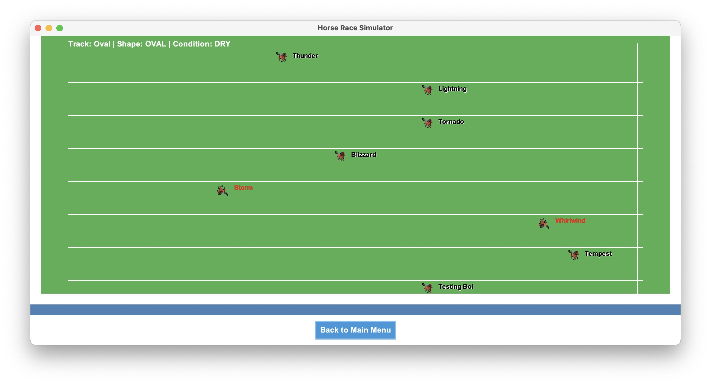

# Horse Race Simulator


A Java-based Object-Oriented Programming project that simulates a horse race with a graphical user interface.



## Project Structure

```
.
├── part1/                # Basic horse race implementation
│   ├── src/              # Source code for part 1
│   └── README.md         # Part 1 specific instructions
├── part2/                # GUI implementation
│   └── src/              # Source code for part 2
│       ├── models/       # Data models
│       ├── ui/           # User interface components
│       ├── utils/        # Utility classes
│       ├── data/         # Data files
│       └── images/       # Image resources
└── README.md             # This file
```

## Prerequisites

- Java Development Kit (JDK) 22 or higher

## Setup Instructions

### Part 1: Basic Implementation

```bash
# Navigate to part1 directory
cd part1

# Compile the Java files
javac *.java

# Run the tests
java -cp part1 HorseTest
java -cp part1 RaceTest
```

### Part 2: GUI Implementation

```bash
# Navigate to part2 directory
cd part2

# Compile the Java files
javac -cp ".:src" src/**/*.java

# Run the application
java -cp ".:src" ui.startRaceGUI
```