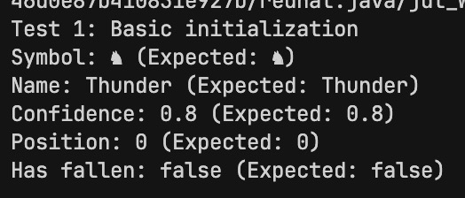
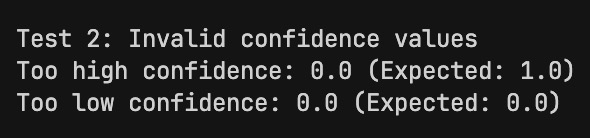
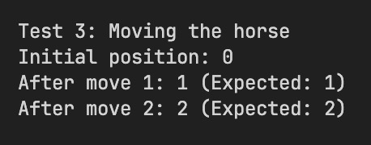
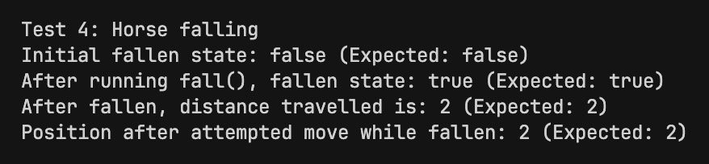

# OOP Horse Racing Simulator Part 1 Report

Author: Tsz Wo Bernard Lee(240340049)

## Task 1: Write the Horse Class according to specifications

### Encapsulation Explaination

Encapsulation refers a concept in Object-Oriented Programming where the data and the methods that manipulate them are binded to together in a single object. It's a way to hide the implementation details of an obejct from the user, while still allowing access to its necessary functionallity. 

In Java, all fields of a class is accessible from outside the object itself unless otherwise specified. To achieve this, we use the `private` keyword to signify that the fields of a class cannot be accessed from outside methods. We use this to prefix all our field definitions in the `Horse` class:

```java
private final String horseName;
private char horseSymbol;
private int distanceTravelled=0;
private double horseConfidence=0.0;
private boolean fallen=false;
```

This makes sure that the value of all fields can only be accessed and modiffied from method specificially defined inside the class. To access and modify the data, we need getter and setter methods. Getter methods refer to methods that return a value of a field of a class. For example, let's say if we want to see if a horse has fallen or not. Instead of leaving the field `public` and using `objectName.fallen` to access the field directly from outside of the class, we create a method within the `Horse` class called `hasFallen()` to  return a boolean value of whether from the `fallen` field of the object. The getter methods in my `Horse` class include:

```java
//Accesses confidence number of Horse object
public double getConfidence() { return this.horseConfidence; }

//Accesses distanced travelled value of Horse object
public int getDistanceTravelled() { return this.distanceTravelled; }

//Accesses name of Horse object
public String getName() { return this.horseName; }

//Accesses symbol of Horse object
public char getSymbol() { return this.horseSymbol; }

//Accesses fallen value of Horse object
public boolean hasFallen() { return this.fallen; }

```

In the same way, setter method provide an interface where the user can manipulate the values stored in fields of the object. They often take in a value as parameter and have a return type `void` as Java uses pass-by-reference for objects. The setter methods in my `Horse` class include:

```java
//Increments the distanceTravelled value by 1
public void moveForward() { this.distanceTravelled++;}

//Sets a new confidence level value
public void setConfidence(double newConfidence){ ... }
    
//Sets a new symbol for the Horse Object
public void setSymbol(char newSymbol) { this.horseSymbol=newSymbol; }
```

Using setter methods has an advantage over letting the user modify the data in the object using the dot notation as it allows for constraints and input validation to be implemented and forces the user to follow these rules to interact with the object. One example of this can be seen in the `setConfidence(double newConfidence)` method, where according to the design specifications the value cannot exceed the allowed bounds(0 to 1). This can be easily implemented with an if statement:

```java
public void setConfidence(double newConfidence)
{
    if(newConfidence>=0.0 && newConfidence<=1.0){
        this.horseConfidence=newConfidence;
    }
}
```

This ensures that the value that is set would never exceed the allowed bounds(i.e no Horse would ever have a confidence higher than 1 or lower than 0)

Essentially, encapsulation allows for more secure and robust code as the how the other parts of the program interacts with this obejct is strictly defined by the developer of this objects and these boundaries must be obeyed for the user to manipulate with the object itself, reducing errors. It also improves modularity and code reusability of the code as it is self-contianed and doesn't need to rely on external dependencies.

### Testing Evidence of `Horse` class

#### Basic initialization and Accessor Methods

The test code is as follows:

```java
System.out.println("Test 1: Basic initialization");
Horse horse1 = new Horse('♞', "Thunder", 0.8);
System.out.println("Symbol: " + horse1.getSymbol() + " (Expected: ♞)");
System.out.println("Name: " + horse1.getName() + " (Expected: Thunder)");
System.out.println("Confidence: " + horse1.getConfidence() + " (Expected: 0.8)");
System.out.println("Position: " + horse1.getDistanceTravelled() + " (Expected: 0)");
System.out.println("Has fallen: " + horse1.hasFallen() + " (Expected: false)");
System.out.println();
```

Results:



#### Invalid Confidence Values

This tests aims to test the input validation of the confidence value in the `Horse` class:

```java
System.out.println("Test 2: Invalid confidence values");
Horse tooHighConfidence = new Horse('♘', "Overconfident", 1.5);
System.out.println("Too high confidence: " + tooHighConfidence.getConfidence() + " (Expected: 1.0)");
```

Results:



#### Moving the Horse

This tests the `moveForward()` functionallity of the `Horse`:

```java
// Test 3: Moving the horse
System.out.println("Test 3: Moving the horse");
Horse horse2 = new Horse('♘', "Lightning", 1.0); // 100% confidence to ensure it moves
System.out.println("Initial position: " + horse2.getDistanceTravelled());
horse2.moveForward();
System.out.println("After move 1: " + horse2.getDistanceTravelled() + " (Expected: 1)");
horse2.moveForward();
System.out.println("After move 2: " + horse2.getDistanceTravelled() + " (Expected: 2)");
System.out.println();
```

Results:



#### Fallen Test

This test if the `fall()` methods works and if the `moveForward()` method validates if the horse has fallen before incrementing the distance travelled:

```java
System.out.println("Test 4: Horse falling");
Horse horse3 = new Horse('⏩', "Clumsy", 0.0); 
System.out.println("Initial fallen state: " + horse3.hasFallen() + " (Expected: false)");
horse3.moveForward();
horse3.moveForward();
horse3.fall();
System.out.println("After running fall(), fallen state: " + horse3.hasFallen() + " (Expected: true)");
System.out.println("After fallen, distance travelled is: " + horse3.getDistanceTravelled() + " (Expected: 2)");
horse3.moveForward();
horse3.moveForward();
horse3.moveForward(); // Should not move when fallen
System.out.println("Position after attempted move while fallen: " + horse3.getDistanceTravelled() + 
                  " (Expected: 2)");
System.out.println();
```

Results:



## Task 2: Improve the Race class

### Identified Issues with Current Implementation

#### Missing null checks

The `startRace()` method doesn't check if any horses are null before attempting to call methods on them. This means that if a lane doesn't have a horse assigned, this will cause a `NullPointerException`

```java
public void startRace(){
  //declare a local variable to tell us when the race is finished
  boolean finished = false;

  //reset all the lanes (all horses not fallen and back to 0). 
  lane1Horse.goBackToStart();
  lane2Horse.goBackToStart();
  lane3Horse.goBackToStart();
  
  //More code below
}
```

As we can see, the `goBackToStart()` method is called without checking if any lanes are `null`

#### Hardcoded lane count

The original Race class is specifically design for exactly three lanes, making it inflexible down the lane if we want to add more horses.

#### No winner announcement/leaderboard

In the current `Race` class implementation, when a horse wins, the race just ends without announcing the winner. There's also no way of keeping track of who finished first and after. 

#### Handling of alternative race outcomes(all horses fall/ties)

The `RaceWonBy()`method only returns true if a horse's distance traveled is exactly equal to the `raceLength`. If multiple horses cross the finish line in the same turn, the race might end without a clear winner.

#### Inconsistent States

The `startRace()` method directly modifies the state of the Horse objects (by calling `goBackToStart()`) without providing a way to reset the `Race` object itself. This could lead to unexpected behavior if you want to run multiple races with the same `Race` object.

#### Code organization

The 0.1 in the `moveHorse()` method for calculating the fall probability is a magic number. It would be better to define this as a constant with a meaningful name to improve readability and maintainability.

#### Invalid math in fall probability

The formula `0.1*theHorse.getConfidence()*theHorse.getConfidence()` means horses with higher confidence are more likely to fall, which seems counterintuitive. This means a confident horse (1.0) has a 10% chance of falling while an unconfident horse (0.1) has only a 0.1% chance.

### Updated Code

#### Dyanmic Lane Count

The updated `Race` class  supports a variable number of lanes through the constructor parameter `numberOfLanes`. The lanes are stored in a `Horse[]` array initialized with the specified size: 

```java
lanes = new Horse[numberOfLanes];
```

When adding horses, the code validates the lane number is within bounds (1 to `numberOfLanes`) and the race won't start unless all lanes have horses assigned (checked in `startRace()`)

```java
public void startRace()
{
    // Check if any lane is empty
    for (Horse horse : lanes)
    {
        if (horse == null)
        {
            System.out.println("Cannot start race: Not all lanes have horses assigned");
            return;
        }
    }
  //More code below
}
```

#### Handling of alternative race outcomes

The race handles three possible outcomes for each horse:

- Finished: When a horse reaches or exceeds the race length

- Fallen: When a horse falls during the race

- In Progress: When a horse is still running

The race continues until all horses have either finished or fallen, as shown in this code:

```java
boolean raceComplete = true;
for (Horse horse : lanes)
{
    if (!raceWonBy(horse) && !horse.hasFallen())
    {
        raceComplete = false;
        break;
    }
}
```

#### Winner announcement and Leaderboard

The race results are handled in a sophisticated way. Horses are sorted by distance traveled using a custom comparator:

```java
Collections.sort(sortedHorses, (h1, h2) -> 
    Double.compare(h2.getDistanceTravelled(), h1.getDistanceTravelled()));
```

The `Collections.sort()` with the lambda expression `(h1, h2) -> Double.compare(h2.getDistanceTravelled(), h1.getDistanceTravelled())` sorts the horses in descending order by their distance traveled. It uses `Double.compare()` which returns a negative number if the first argument is less than the second, zero if equal, or a positive number if greater. By passing h2 first and h1 second, we reverse the natural order to get descending sort (further distances first). 

The leaderboard shows the position (1st, 2nd, etc.), the horse symbol, the status (FINISHED, FELL, or distance traveled) and the distance travelled. An example leaderboard would look like:

```bash
=== RACE RESULTS ===
1. Horse X - FINISHED (100 units)
2. Horse Y - FELL at 75 units
3. Horse Z - Travelled 60 units

WINNER: Horse X!
```

The winner announcement is handled separately. Since we have a dyanmic number of lanes, we can't take the original approach of running it in a if statement:

```java
if ( raceWonBy(lane1Horse) || raceWonBy(lane2Horse) || raceWonBy(lane3Horse) )
{
    finished = true;
}
```

We need a method to be able to dynamic go thorugh the number of lanes there are and check for winners. This is a snippet of the code after the race has finished. Because we can't assume that there is a winner(every horse could have fallen), we have to employ the logic below:

```java
boolean anyoneFinished = false;
for (Horse horse : sortedHorses)
{
    if (raceWonBy(horse))
    {
        anyoneFinished = true;
        System.out.println("\nWINNER: Horse " + horse.getSymbol() + "!");
        break;
    }
}

if (!anyoneFinished)
{
    System.out.println("\nNo winners - all horses fell!");
}
```

This method checks if any horse finished the race. If a horse finished, it announces that horse as the winner. If no horses finished (all fell), it announces "No winners - all horses fell!".
